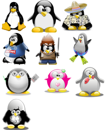

# Pack svg or png sprites

Create a pack of sprites from a directory of png/jpg/gif/svg images.

Images are packed at best to a square-ish png file, and their size and coordinates are exported to a json file.


## Usage

### Global command

```
NAME:
   spritizer - Create sprites from a directory of images

USAGE:
   spritizer [global options] command [command options] [arguments...]

COMMANDS:
   gen, g   Generate sprites
   help, h  Shows a list of commands or help for one command

GLOBAL OPTIONS:
   --debug     Set logging to debug (default: false)
   --quiet     Only log errors (default: false)
   --help, -h  show help (default: false)
```

### Gen command

```
NAME:
   spritizer gen - Generate sprites

USAGE:
   gen - generate sprites

OPTIONS:
   --inkscape                  Use inkscape if available to process svg (default: false)
   --resize value              Resize to [resize] pixels width (default: 0)
   --name value, -n value      Output name (default: "sprite")
   --template value, -t value  Go template to use for textual data
   --ext value, -e value       Summary file extension (default: ".json")
   --help, -h                  show help (default: false)
```

Default template for output is : 

```gotemplate
{{- $last := sub ( len .Sprites ) 1 -}}
{	
{{- range $i, $c := .Sprites }}
	"{{ $c.Name }}": {
		"height": {{$c.H}},
		"width": {{$c.W}},
		"pixelRatio": 1,
		"x": {{$c.X}},
		"y": {{$c.Y}}
	}{{ if ne $i $last }},{{ end }}
{{- end }}
}
```

The context for template processing is the images collection : 

```go
type Collection struct {
	W       int        // collection total width
	H       int        // collection total height
	Fill    int        // collection fill percent
	Sprites []*Sprite  // list of sprites
}
```

with sprites given as 

```go
type Sprite struct {
	W    int          // sprite width
	H    int          // sprite height
	X    int          // sprite x position
	Y    int          // sprite y position
	Name string       // sprite name
	File string       // sprite orig file
	Data image.Image  // sprite image data
}
```

http://masterminds.github.io/sprig/ library is loaded for template processing.
 

## Examples

using example/input directory containing `tux[1-8].png` and `thetux[1-2].svg`

```bash
spritizer gen --resize 64 example/input example/output
```

generates the following png
 
 

and json file (by default, using mapbox sprites style)

```json
{
	"thetux": {
		"height": 75,
		"width": 64,
		"pixelRatio": 1,
		"x": 0,
		"y": 0
	},
	"tux1": {
		"height": 64,
		"width": 64,
		"pixelRatio": 1,
		"x": 64,
		"y": 0
	},
	"tux2": {
		"height": 64,
		"width": 64,
		"pixelRatio": 1,
		"x": 128,
		"y": 0
	}, ...
```

For svg files, https://github.com/srwiley/oksvg is used for rasterization.
But this rasterizer only implements a subset of the SVG2.0 specification => some svg files
cannot be rasterized or may contain some errors. If `inkscape` is available, it is used to 
rasterize the svg files not recognized by oksvg. You can choose to always use inkscape using 
the `--inkscape` flag.

`--resize HEIGHT` argument force all images with a height greater or requal to `HEIGHT` to be resized to `HEIGHT` 
pixels height.


## Docker

A docker container containing `inkscape` and `spritizer` is available : https://hub.docker.com/r/jmbarbier/spritizer

```bash
docker run --rm -v ${pwd}:/data jmbarbier/spritizer gen --resize 100 --inkscape /data/input /data/output
``` 
 

 


